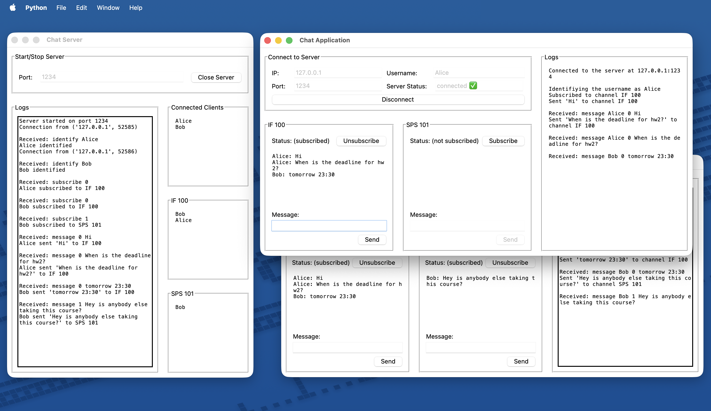

# NetChat — Multi-Client Messaging System

A lightweight **client–server messaging app** built with Python sockets and Tkinter.  
Supports **multiple concurrent clients**, **channel subscriptions**, and **real-time messaging**. showcasing fundamentals of secure communication, authentication, and networked systems.



---

## 📍 Features

### Server
- Handles **multiple TCP clients** concurrently using threading.  
- Enforces **unique usernames**; rejects duplicates.  
- Maintains **subscriber lists per channel** and multicasts messages only to relevant clients.  
- GUI dashboard shows connection logs, connected users, and active subscriptions.  
- Graceful shutdown sends a `closed` signal to all clients.

### Client
- Connects via IP and port with chosen username.  
- Subscribes/unsubscribes to two fixed channels [`IF100`, `SPS101`]; hardcoded but can be extended.
- Sends and receives messages only for subscribed channels.  
- Displays connection status and message logs in a Tkinter GUI.  
- Handles disconnects and server closures safely.


## 📍 Tech Stack
- **Language:** Python 3.10+  
- **Libraries:** `socket`, `threading`, `tkinter` (all standard library)  
- **Concepts:** Concurrency, Client-Server Architecture, Authentication, GUI Design, Logging  


## 📍 Architecture
```
┌───────────┐        TCP/IP        ┌───────────┐
│ Client    │ <------------------> │  Server   │
│ GUI App   │                      │  Tkinter  │
│ (Tkinter) │  sockets,            │  Threads  │
│           │  message protocol    │  Logging  │
└───────────┘                      └───────────┘
```
Each client runs on a separate thread in the server.  
Messages follow a simple command protocol:  
- `identify <username>`  
- `subscribe <channel_id>`  
- `message <channel_id> <content>`  
- `unsubscribe <channel_id>`  
- `disconnect`


## 📍 Getting Started

```bash
# 1. Clone the Repository
https://github.com/aryahassibi/NetChat.git
cd NetChat

# 2. Run the Server 
python3 server.py
# Enter a port (e.g., 1234) and start the server.

# 3. Run the Client(s) 
python3 client.py
# Enter the server’s IP (e.g., 127.0.0.1), port, and a unique username, then connect.

# 4. Chat
# Subscribe to a channel and start messaging other connected clients.
```

## 📍 What It Demonstrates

* Practical use of **network programming** (TCP sockets, concurrency).
* Implementation of **basic authentication & access control** logic.
* **GUI integration** with real-time socket I/O.
* Relevant skills for **network security**, **PAM systems**, and **telecom-grade access control** development.
